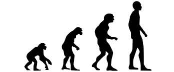
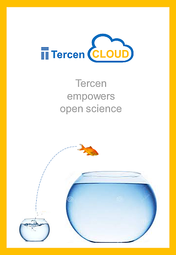

```{r setup, include=FALSE}
knitr::opts_chunk$set(echo = FALSE)
```

# Part 1

## Welcome, blast off
<center></center>


<center>workshop on github </center>

<center>(https://github.com/tercen/user_workshop)</center>

## Agenda

- intro to Tercen
- concepts (e.g. measurements, table, computed table)
- loading up data (e.g. csv and tsv)
- creating a Tercen workflow
- visuals (points, heatmaps, line graphs, bar graphs, pairwise)
- visual wrangling
- navigate (in data, in projects)

## Why we started Tercen

- the story


## Researchers' Challenges

* Get control
* Handle large data sizes
* Integrate any database
* Visualize and interact
* Knowing what algorithm to use


<center></center>

## Tools evolution

* Calculators, log tables (_homo homini_)
* Excel and Graphpad (_homo australopithecus e.g. Lucy_)
* Tercen (_homo habilis_)
* Unknown (_homo sapien_)
<center></center>
## Thus....

<center></center>
<center></center>

## Features

* Store
* Compute
* Visualize

<center></center>


## Concepts and terms

- measurement (e.g. gene expression value)
- variable (e.g. gene)
- observation (e.g. samples )
- annotation (e.g. of genes or sample)

<center>all are factors!!!</center>

## Wide format

```{r results = 'asis'}
data <- read.delim2(file = file.path("..", "data","genes_wide.tsv")) 
knitr::kable(data[, 1:3], align = "lll")
```

## Long format

```{r results = 'asis'}
data <- read.delim2(file = file.path("..", "data","genes_long.tsv")) 
knitr::kable(data[1:6,], align = "lll")
``` 

## Computed table

After a mean operator of all genes per sample:

```{r results = 'asis'}
data <- read.delim2(file = file.path("..", "data","genes_mean.tsv")) 
knitr::kable(data[1:2,], align = "lll")
``` 

## Relational algebra
- how to define a relation between two Tables
- operators create new Tables (but also relations)
- relations between tables
- more info (https://en.wikipedia.org/wiki/Relational_algebra)
- be careful of the vocabulary
- need only understand the concepts

## Univeral table
- Tercen sees all the tables as one big integrated table

## Wrangling

- visual wrangling
- data wrangling
- computational wrangling

```{r echo = FALSE}

pie(c(80,20), labels=c("Wrangle", "Compute"), main="Where is time spent?", col=c("orange","green"), border="white", clockwise=FALSE)

```

## Let's start

- does everyone have the chrome browser installed?
- how many have a laptop with Windows?
- how many have a laptop with Linux?
- how many have a Mac?
- how many do not have a laptop?
- how many have excel, or libreoffice?

## Let's start

Use chrome and go to:

https://dev.tercen.com/  

login: `lucy2` 

password: `habilis2`

## Set up

- Create a team 
   - use your name for the team name
- Create a project
   - use `khan 2001`
- Click on the newly created project
   - There is a new menu on the left
       - `Create a data set`
       - `Create a workflow`
       - `Import a workflow`
   
## Download the data for workshop

To download the data perform the following:

- click on https://raw.githubusercontent.com/tercen/user_workshop/master/data/khan_long.csv
- right click and "Save As" onto desktop

## Create the data in Tercen

- click on `Create a data set`
- browse to the data set on your desktop
- click on `OK`

## Create a workflow in Tercen

- click on `Create a workflow`
- give `khan` as workflow name
   - a white canvas appears

## Add table

- right click on canvas and choose `Add`
- select `Table`
- select `khan_long`
   - a table step appear on the canvas
- right click on the new table step and choose `Rename`
   - rename it what you like, suggestion: `khan2001`
   
## Add data step

- right click on table step and select `Add`
- select `Data step`
   - Data step opens
   
## Configure data step

- drag-n-drop `measurement` to y-axis
- drag-n-drop `sample name` to col
- drag-n-drop `gene_symbol` to row
- drag-n-drop `measurement` to color
- select `heatmap` in drop down menu
- resize the heatmap


## Welcome to Tercen
<center></center>

<center>...welcome to Tercen...</center>

## Navigating heatmap

- scrolling rows
- scrolling columns
- squashing/expanding rows
- squashing/expanding columns
- squashing/expanding cell/datapoint

## Color palettes

- different types
- different values

## Bar graphs (sample replicates)
- create a bar graph

## Line graphs (gene profiles)
- create a gene profile

## Pairwise sample plots
- create a sample vs sample

## Save workflow

- save icon on workflow tab
- icon disappears when saved

## Project Navigation 

To go up:
The top left icon allows you to navigate to up one level

- click on folder icon, to get up to project
- click on people icon, to get up to team

To go down:
- click on project
- click on workflow
- click on data

## Coffee break

<center></center>

# Part 2

## Recap Part 1
- motivation
- table concept
- teams, projects, workflows
- visual wrangling (i.e. projections) using cross-tab

## Agenda Part 2

- computation
- group comparisons (e.g. t-test, anova)
- dimension reduction (e.g. pca, tsne)
- venn diagrams (e.g. shiny venn)
- using biological database (e.g. adding gene annotation)
- exporting

## Computation concepts

- table
- variables as rows
- observations as columns
- operator computes
- computed table

## Output relations

- per data point
- per cell
- per row or col
- per table

## Tercen operators

- github operators
- applibrary
- operator help 

## Tercen operator examples

- Log (per point)
- Mean (per cell)
- hclust (per row, per col)
- pca (per col)

## Install operators

- go to the Team
- check "My site"
- go to "Install"
- Tercen, Site, Git
- go to "Tercen"
  - mean, t-test, anova-1, pca, tsne


## Anova-1 way

- row zone put gene_symbol (i.e. the variable)
- col zone put sample_name (i.e. the sample)
- data of the many groups into one cell  
- use color to identify the groups
- optional use of the x-axis

## T-test

- use y-axis for measurement
- data of two groups per cell
- use color to determine two group per cell
- output is p value per cell

## TSNE dimension reduction

- variables on rows
- observations on cols
- measurement on y-axis
- output is a returned per col
- perplexity setting !!!!

## PCA dimension reduction

- variables on rows
- observations on cols
- measurement on y-axis
- output is a returned per col

## Gather step

- many columns to two columns
- one annotation (i.e. variables) and one measurement (i.e. value)
- same as wide to long concept
- abstraction

Wide -> Long = abstraction


## Install Shiny Venn operator
- not in app store but on git tercen
- go to the Team
- check "My site"
- go to "Install"
- Tercen, Site, Git
- go to "Git"
  - for Url use (`https://github.com/tercen/venn_shiny_operator`)
  - for Version use `1.0.4`


## Venn diagram

- add a data step to the t-test
- left tab output "operator view" of venn


## Join
- download the data
- upload to tercen
- add a join step
- make a view with new factors

## Export your data

- add an export step to t-test
- data is the project 


## Summary

- install operators
- run operators
- view the operator results
- operator relations
- operator examples, t-test, anova
- venn shiny operator
- export

## Part III

- one-2-one sessions
- practice
- use you own data

## End

<center></center>


## Guides

<left></left>
<right></right>

